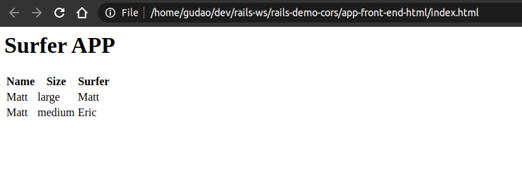

# Hello Vanilla Frontend JavaScript


## Develop the project `app-front-end-html`

### DO (add a html file)
```bash
touch index.html
```
```bash
nano index.html
```
```bash
<!--FILE (index.html) -->
<html>
 <head>
   <meta charset="UTF-8">
   <meta name="viewport" content="width=device-width, initial-scale=1.0">
   <meta http-equiv="X-UA-Compatible" content="ie=edge">
   <script src="index.js"></script>
   <title>Document</title>
 </head>
 <body>
   <h1>Surfer APP</h1>
   <table id="surfer-table">
   <tr>
     <th>Name</th>
     <th>Size</th>
     <th>Surfer</th>
   </tr>
 </table>
 </body>
 </html>
```

### DO (add a js file)
```bash
touch index.js
```
```bash
nano index.js
```
```bash
<!--FILE (index.js) -->
document.addEventListener("DOMContentLoaded", () => {
  console.log("DOM content has loaded")
  let url = "http://localhost:3000/boards/index"
  fetch (url)
  .then(resp => resp.json())
  .then(data => data.forEach(board => {
    displayRow(board)}))
})

function displayRow(row){
  const table = document.querySelector("#surfer-table")
  table.innerHTML +=
  `
  <tr>
    <td>${row.name}</td>
    <td>${row.size}</td>
    <td>${row.surfer_id}</td>
  </tr>
  `
}
```


## Use the Project

### the project structure
```
PROJECTS_ROOT
|- app-back-end-html
    |- All rails generated files
|- app-front-end-html
    |- index.js
    |- index.html
```

### get the project `app-back-end-html`
```bash
git clone -b app-back-end-html https://github.com/cnruby/rails-demo-cors.git app-back-end-html && \
cd app-back-end-html
```
```bash
./bin/rails server
```

### get the project `app-front-end-html`
```bash
git clone -b app-front-end-html https://github.com/cnruby/rails-demo-cors.git app-front-end-html && \
cd app-front-end-html
```

```bash
google-chrome index.html 
```
```bash
    # >>> Result
```
